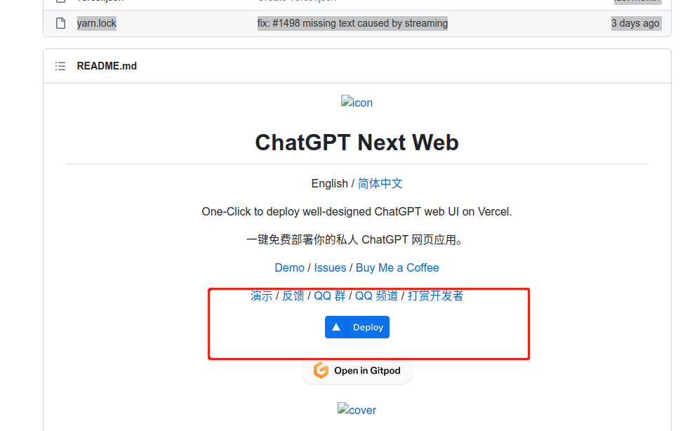
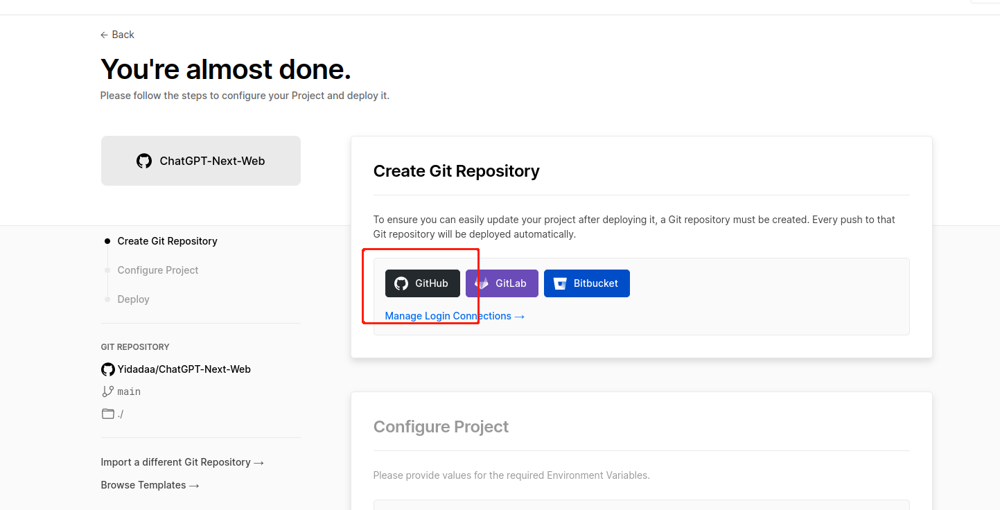
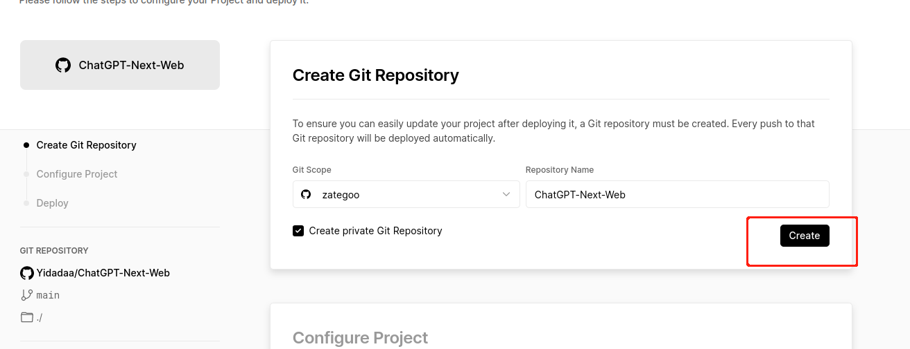
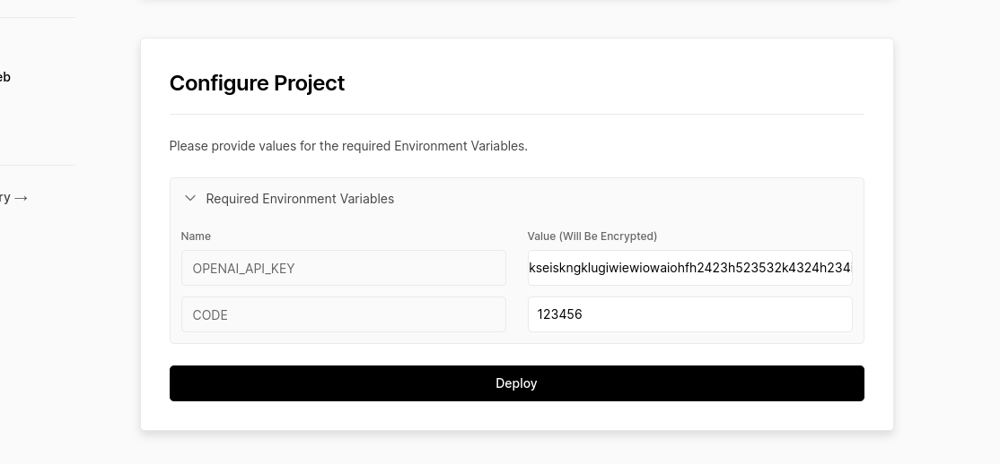
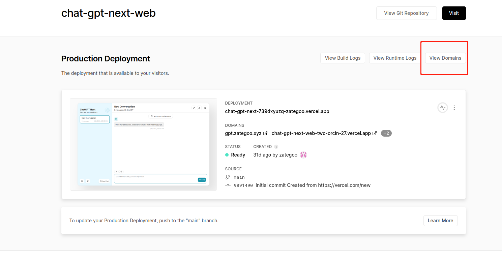
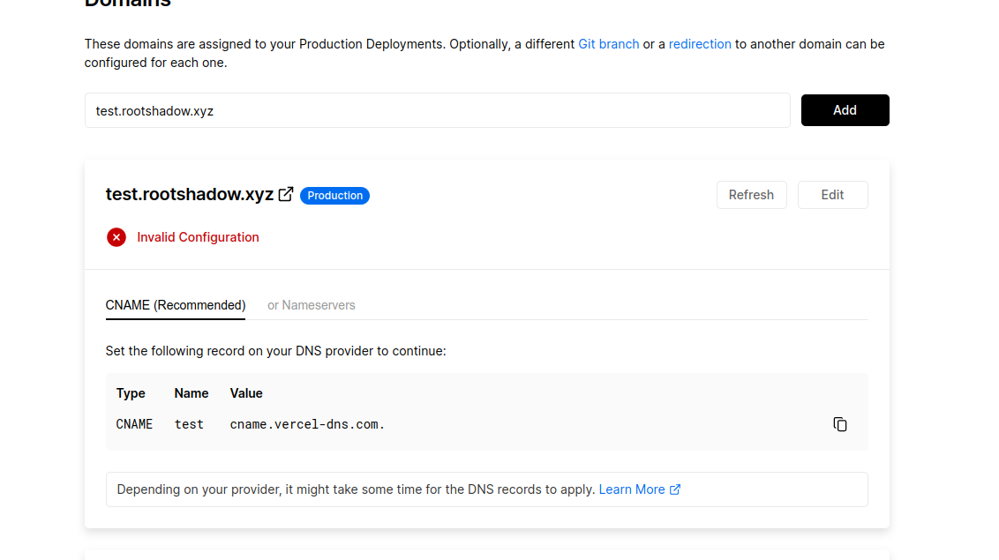
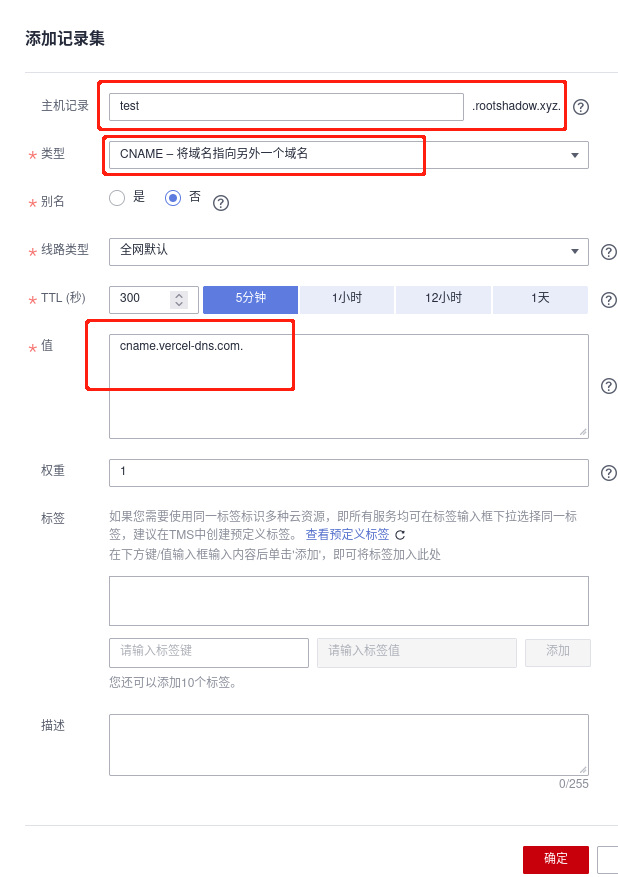

# 简单部署ChatGPT

使用<https://vercel.com/>免费部署ChatGPT网页

## 前期准备
1. 能科学上网
2. 注册一个github帐号
3. 注册或者买一ChatGPT帐号,获取到api-key,可以在这个网站买一个<https://www.cstorv.com/>
4. 最好有一个域名,如果没有域名每次使用都需要挂梯子

## 部署流程

 使用开源项目
<https://github.com/Yidadaa/ChatGPT-Next-Web>

向下拉页面找到 readme.md 直接点Deploy

然后转到cercel.com的页面 使用github登录

登录之后点create会自动fork这个开源项目

填写配置文件,然后点deploy等一会儿,就部署完成了

*  OPENAI_API_KEY   :   填写ChatGPT的api-key
*  CODE             :   设置一个你自己的密码

## 域名配置

在项目页面中点 ViewDomains

添加一个你的子域名, 然后点Refresh会弹出一个CNAME的DNS解析配置

给子域名添加CNAME解析,这边以华为云为例
